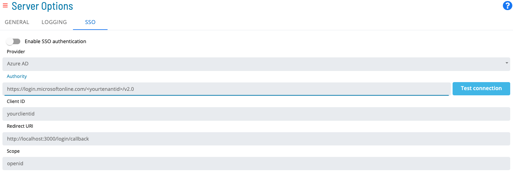
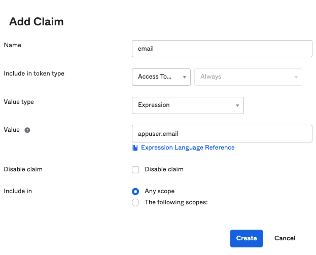
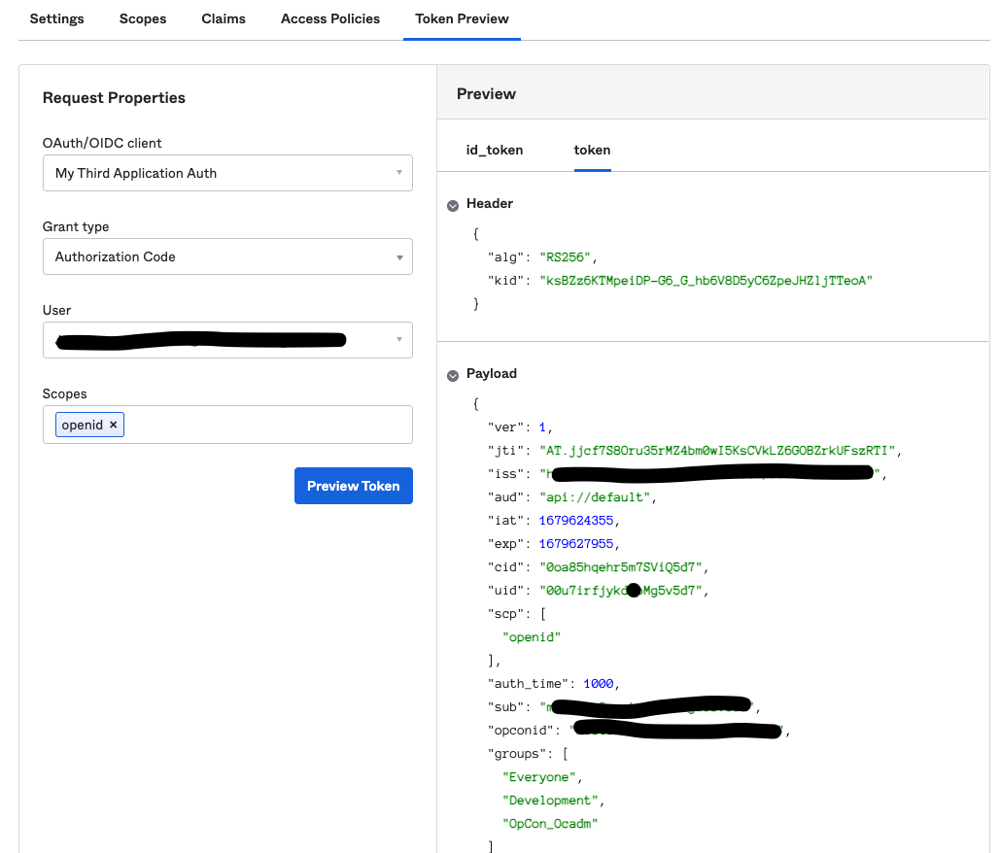
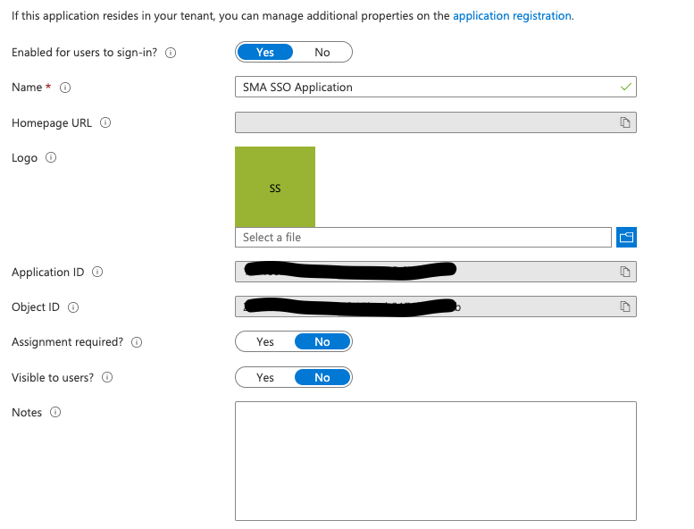

# Managing SSO Configurations

## Required Privileges

In order to access the Server Options page and configure the Single Sign-On setting, you must have the following:

- **Role**: User must be assigned to the Role_ocadm.

---

## Configuring SSO

To configure SSO Settings, go to **Library** > **Server Options** > click on the **SSO** panel.

#### SSO Configuration Fields

1. Click on the **Switch** to enable access to the SSO login button.

1. Enter a **Provider**. The identity provider (IdP) for the client should be selected from the **Provider** dropdown. Options include **Okta**, **Azure**, and **Other**.

1. Enter an **Authority**. **Authority** is the URL of the OIDC/OAuth2 provider.

1. Enter a **Client ID**. This is your client application's identifier as registered with the OIDC/OAuth2.

1. Enter a **Hostname**. The **hostname** property of the URL interface is a string containing the domain name of the URL (make sure to include **HTTP** or **HTTPS** and the **port number** if applicable). For example, **https://host.com:80443**.

1. Enter an **Audience**. The **Audience** identifies the recipients that the JWT is intended for.

1. Enter a **Scope**. The **Scopes** being requested from the OIDC/OAuth2 provider (default: "openid"). You can enter various scopes separated by an empty space. For example, **openid** **email**.

#### Group Mappings

1. Enter a **Group Name**: this should match the group name used in your IdP.

1. Enter a **Role**: this value represents a valid **OpCon** role.

1. Select **Save**.

:::note

1.  If the switch is in the **On** position, the user must input values in all fields including values for **Group Mappings**.
2.  Examples of how to gather these requirements will be posted below (for the [**Okta Application**](#okta-application) and the [**Azure Application**](#azure-application)).
3.  SSO can be implemented with any IdP as long as the required values are provided.

:::

The following are a list of actions that will take place when a user logs in through Single Sign-On.

| Exists in IdP Group | Exists in OpCon | Member of OpCon Role | Can access application in IdP | Enabled in OpCon | Action Taken                                              |
| ------------------- | --------------- | -------------------- | ----------------------------- | ---------------- | --------------------------------------------------------- |
| Y                   | Y               | Y                    | Y                             | Y                | No action user is already in sync                         |
| Y                   | N               | N/A                  | Y                             | N/A              | User created and added to role                            |
| Y                   | Y               | N                    | Y                             | Y                | User added to role                                        |
| Y                   | Y               | Y                    | Y                             | N                | User enabled in OpCon                                     |
| Y                   | Y               | Y                    | N                             | Y                | No action since user cannot access the application        |
| Y                   | Y               | Y                    | N                             | N                | No action since user cannot access the application        |
| N                   | Y               | Y                    | N/A                           | Y                | No action since user does not belong to an existing group |
| N                   | Y               | Y                    | N/A                           | N                | No action since user does not belong to an existing group |
| N                   | N               | N/A                  | N/A                           | N/A              | No action                                                 |

:::tip Group Mappings

- Group name values should be unique.
- Group names can be linked to many roles.
- Roles can be linked to many group names.

:::

:::tip Example
The following is an example of filling out the required fields:

1. SSO Settings:
   
1. Group Mappings:
   

:::

---

### Creating an applications that are OpenID Connect Compatible

#### Okta Application

This document will describe the steps needed to create a custom application in Okta to return custom optional claims in a access token that will be used by SMAOpConRestApi.

1.  After you’ve logged in to Okta, click "Admin" in the upper right corner to go to the administration dashboard
    - 
1.  Once on the administration dashboard, click “Applications” from the left navigation to go to Applications
    - 
1.  Click the "Create App Integration" button
    - 
    1.  Inside the modal, select the following options: 1. Sign-in method: OIDC - OpenID Connect 1. Application type: Single-Page Application
    - 
    1. Click on "Next"
    1. Set the following options:
       1. Grant type: Authorization
       1. Sign-in redirects URIs:(sample) `https://<hostname:443>/login/callback`
          1. The **hostname** will be used on the SSO Configuration page in Solution Manager. Make sure to include **HTTP** or **HTTPS** and the **port number** if applicable
       1. The value for the URL to access Solution Manager will be used in the SSO Configuration page
       1. Sign-out redirects URIs: This value is not necessary
       1. Controlled access: Allow everyone in your organization access (for this example)
       1. If an option was not listed, you may select the one that is more convenient for your organization
       1. Set controlled access based on your organizations needs
       - 
    1. Click on "Save".
    1. Note down the “Client ID” value, this will be used to configure SSO in Solution Manager
1.  After creating the application, go the newly created application and go to "Assignments"
    1. Assign the users from your organization to the new application
    - 
1.  Go to the "Security" section in the main menu and select "API"
    1. In the "Authorization Server" tab select the "default" server
       1. Note down the Issuer URI for the “default” row, this value will be the “authority” which will be used in the configuration screen for SSO
    1. Inside the "default" authorization server select the "Claims" tab
    - 
    1. Click on "Add Claim"
       1. The following is an example on how to add a custom claim
       - 
       1. Make sure the token type is Access Token and that you enter **`.*`** for the regex logic
       1. Make sure to name claims “**groups**”
       1. Repeat the process to add an “**email**” claim
          1. Make sure to add **appuser.email** in the **Value** text field
       - 
    1. Click on the “Settings” tab and take notes of the following values:
       1. Audience, this will be used in the SSO Configuration page inside Solution Manager
       1. Issuer, this will be used as the “Authority” value in the SSO Configuration page
       - 
    1. Go to the "Token Preview" tab
       1. Type the name your newly created application
       1. Select **Authorization Code** for the "Grant Type"
       1. Select a user that has access to this application
       1. Type "**openid**" in the "Scopes" textbox. These scopes are required for SSO implementation in Solution Manager
       1. Click on "Preview Token" then click on the "token" tab to view the access token. Make sure the “group” and “email” claims are displayed
       - 
1.  Then click on the "Access Policies" tab

- 
  1. Click on "Edit" in the "Default Policy Rule" row. Make sure that the "Authorization Code" option is selected, the rest are optional:
  - 

:::note

- Make sure to the values of “**openid**“ in the Scope textbox inside the SSO Configuration page inside Solution Manager.
- Make sure the **email** for the users allowed to access the application matches the username. This value will be used to pair with an existing OpCon user or it will be used to create a new user in the OpCon environment.

:::

#### Azure Application

This document describes the steps needed to create a custom application in Azure AD that will grant SMAOpConRestApi access to Microsoft Graph API to retrieve user information.

1. Go to "Azure Active Directory"
1. Go to "App registration"
   1. Select new registrations
      1. Add a name to the new application
      1. Select who can access the application
         1. For example: Single tenant
      1. Select Single-page application (SPA)
      1. Select the redirect URL
         1. For example, `https://<yourhostname>:8080/login/callback`
         1. Make sure to add “**login/callback**”
      1. The **Hostname** used in the redirect URL will be used in the SSO Configuration page inside Solution Manager. Make sure to include **HTTP** or **HTTPS** and the **port number** if applicable
   1. Register Application
1. Select the newly created application
   1. From the “Home” menu go to Azure Active Directory => App registrations => Select your new application
1. Go to "Authentication" on the side menu
   1. Ensure there is a redirect value in the single-page application area. For example, `https://<yourhostname>:8080/login/callback`
   - 
1. Go to “Overview” in the left navigation menu
   1. Note down the following information, you will need it later:
   1. The application (client) ID will be used as the Client ID in the configuration screen inside Solution Manager
   1. Click on “Endpoints” and note down the OpenID Connect value
   1. Copy this value and paste it on a browser and find the issuer value inside the JSON
      1. It is highly recommended that you copy this text from the browser and paste it into an application that can format the JSON value
      - 
1. Go to “API permissions” which is found on the left navigation menu
   1. Select Add a permission
   1. Click on “Add a permission” and select Microsoft Graph
      - 
   1. Select “Delegated permissions” and type **groupmember** in the search textbox. Select the **GroupMember.Read.All** permission:
      - 
   1. Next type **user.read** in the search textbox and select **User.Read** permission
   1. Click on “Add permissions” to save and then click on “Grant admin consent”
      - 
1. Go to “Manifest” on the left navigation menu
   1. Search for “**accessTokenAcceptedVersion**” and set the value to **2**
   - 
   1. Then search of the term “**resourceAppId**” and note down the value. This will be used as the **Audience** value in the SSO Configuration page in Solution Manager
   - 
1. Restrict access to the application (optional).
   1. Go to Azure Active Directory -> Enterprise Applications > All applications and select the application you want to configure
   1. Select Properties and set "Yes" in the Assignment Required field and save the changes
   - 
   1. Make sure to assign users and groups which need to grant access to the application. Go to Under Manage, select the Users and groups > Add user/group
   1. Select the users or groups you want to allow and assign them access to your application. Confirm that the users and groups you added are showing up in the updated Users and groups list
   1. Now only those users/groups are allowed to access to the application

:::note

- Make sure to add the “**openid**” Scope in the SSO Configuration page inside Solution Manager

:::

---
